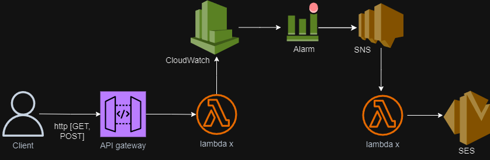

# Reporting Errors in realtime with customized error messages for serverless backend build on AWS Lambda and API Gateway

We used serverless framework to create backend resources

We create a metric filter for our log group manually

We create an alarm for this metric filter manually. The alarm should drigger an SNS topic

## What are the resources used in this architecture?

API Gateway

Lambda (lambda role manually created to access SES and cloudwatch. ARN of role used in code)

Cloudwatch

Alarm

SNS (Created Manually with an access policy to allow lambda and cloudwatch alarms)

SES

The Diagram below shows the architecture.

